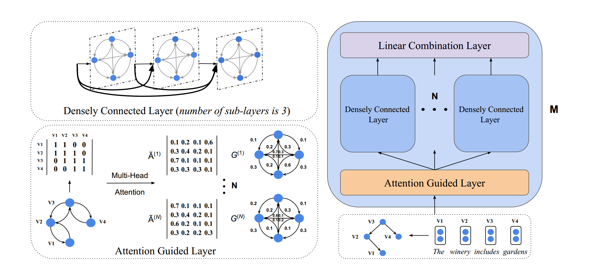

Attention Guided Graph Convolutional Networks for Relation Extraction
==========

This paper/code introduces the Attention Guided Graph Convolutional graph convolutional networks (AGGCNs) over dependency trees for the large scale sentence-level relation extraction task (TACRED).

You can find the paper [here](http://www.statnlp.org/wp-content/uploads/2019/06/Attention_Guided_Graph_Convolutional_Networks_for_Relation_Extraction.pdf)

See below for an overview of the model architecture:



  

## Requirements

Our model was trained on GPU Tesla P100-SXM2 of Nvidia DGX.  

- Python 3 (tested on 3.6.8)

- PyTorch (tested on 0.4.1)

- CUDA (tested on 9.0)

- tqdm

- unzip, wget (for downloading only)

There is no guarantee that the model is the same as we released and reported if you run the code on different environments (including hardware and software). You can find the the [logs](https://github.com/Cartus/AGGCN_TACRED/blob/master/logs.txt) and the [config](https://github.com/Cartus/AGGCN_TACRED/blob/master/config.json) under the main directory. If you train the model by using the default setting, you will get the exact same output in the logs.txt. We also report the the mean and std of F1 score, the stats is 68.2% +- 0.5%. The random seeds are 0, 37, 47, 72 and 76.

## Preparation

  

The code requires that you have access to the TACRED dataset (LDC license required). Once you have the TACRED data, please put the JSON files under the directory `dataset/tacred`.

  

First, download and unzip GloVe vectors:

```
chmod +x download.sh; ./download.sh
```

  

Then prepare vocabulary and initial word vectors with:

```
python3 prepare_vocab.py dataset/tacred dataset/vocab --glove_dir dataset/glove
```

  

This will write vocabulary and word vectors as a numpy matrix into the dir `dataset/vocab`.

  

## Training

  

To train the AGGCN model, run:

```
bash train_aggcn.sh 1
```

  

Model checkpoints and logs will be saved to `./saved_models/01`.

  

For details on the use of other parameters, please refer to `train.py`.

  

## Evaluation

  

Our pretrained model is saved under the dir saved_models/01. To run evaluation on the test set, run:

```
python3 eval.py saved_models/01 --dataset test
```

  

This will use the `best_model.pt` file by default. Use `--model checkpoint_epoch_10.pt` to specify a model checkpoint file.

## Retrain

Reload a pretrained model and finetune it, run:
```
python train.py --load --model_file saved_models/01/best_model.pt --optim sgd --lr 0.001
```

## Related Repo

The paper uses the model DCGCN, for detail architecture please refer to the TACL19 paper [Densely Connected Graph Convolutional Network for Graph-to-Sequence Learning](https://github.com/Cartus/DCGCN). Codes are adapted from the repo of the EMNLP18 paper [Graph Convolution over Pruned Dependency Trees Improves Relation Extraction](https://nlp.stanford.edu/pubs/zhang2018graph.pdf).

## Citation

```
@inproceedings{guo2019aggcn,
 author = {Guo, Zhijiang and Zhang, Yan and Lu, Wei},
 booktitle = {Proc. of ACL},
 title = {Attention Guided Graph Convolutional Networks for Relation Extraction},
 year = {2019}
}
```
